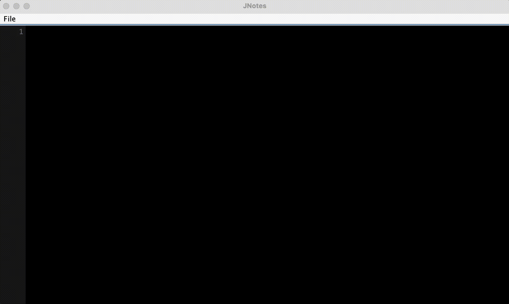

# JNotes


JNotes is a simple text editor I'm developing to explore the challenges that arise when building something seemingly simple, 
like a text editor. The inspiration for this project came from Austin Z. Henley's article,
[Challenging projects every programmer should try](https://austinhenley.com/blog/challengingprojects.html), which highlights various data structures I might use and other
interesting key concepts.

## Features
- [x] Enter and edit text.
- [x] Insert new lines.
- [x] Delete characters to the left or right of the cursor.
- [x] Navigate the cursor using arrow keys (up, down, left, right).
- [x] Highlight text in any direction from the cursor.
- [x] Jump the cursor to the start or end of a line.
- [x] Highlight text from the cursor to the start or end of a line.
- [x] Undo and redo actions.
- [x] Save, Save As and Open file.
- [x] Show lines number.

## Approach and design choices
The first naive approach I've used to handle the logic for sequential characters insertion, deletion, cursor movement
and adding new lines was to use an **ArrayList**. However, it wasn't efficient for character insertion and deletion as,
in the worst case scenario, the operation would take O(n) time complexity.

The final approach that I've decided to use is to implement a [GapBuffer](https://en.wikipedia.org/wiki/Gap_buffer) data
structure which reduces the time complexity of insertion and deletion to O(1). This data structure however can be quite
"expensive" for the cursor movement.

To manage user operations such as character insertion and deletion in a structured manner, I have used
the [Command design pattern](https://refactoring.guru/design-patterns/command) which enforces the *Single Responsibility Principle*
and *Open/Closed Principle*.



## Requirements

- Java JDK 22 or higher.
- Maven 3.6.0 or higher (for building and running tests).
- JUnit 5 5.10.0 (for unit testing).

## Clone the repository

```bash
git clone https://github.com/zhrfrd/JNotes
```

## Build the project

If you have Maven installed:
```bash
mvn clean install
```

## Running Tests
This project uses **JUnit 5** for unit testing.

### Maven
Run all JUnit tests under `src/text/java`:
```bash
mvn test
```
Run a specific test class:
```bash
mvn -Dtest=GapBufferTest test
```

### Gradle
Run all JUnit tests under `src/text/java`:
```bash
./gradlew test
```
Run a specific test class:
```bash
./gradlew test --tests "zhrfrd.jnotes.GapBufferTest"
```

## Repository structure
```
JNotes/
├── src
│   ├── main
│   │   ├── java
│   │   │   └── zhrfrd
│   │   │       └── jnotes
│   │   │           ├── buffer
│   │   │           │   └── GapBuffer.java
│   │   │           ├── command
│   │   │           │   ├── Command.java
│   │   │           │   ├── CommandManager.java
│   │   │           │   ├── CopyCommand.java
│   │   │           │   ├── DeleteNextCharCommand.java
│   │   │           │   ├── DeletePreviousCharCommand.java
│   │   │           │   ├── HighlightCommand.java
│   │   │           │   ├── InsertCharCommand.java
│   │   │           │   ├── Command.java
│   │   │           │   ├── MoveCursorCommand.java
│   │   │           │   └── PasteCommand.java
│   │   │           ├── ui
│   │   │           │   ├── JAreaText.java
│   │   │           │   ├── JAreaTextMenuBar.java
│   │   │           │   └── JLineNumberPanel.java
│   │   │           ├── util
│   │   │           │   └── Direction.java
│   │   │           └── Main.java
│   │   └── resources
│   └── test
│       ├── zhrfrd
│       │   └── jnotes
│       │       └── myeditor
│       │           ├── buffer
│       │           └───── GapBufferTest.java
├───────┴── resources
├── pom.xml
├── README.md
└── .gitignore
```

## Future improvements
- [ ] Add support for mouse selection, highlight, copy, cut and paste.
- [ ] Adjust text highlight height.
- [ ] When deleting text after resizing the buffer, re-shrink the buffer in order to not waste too much memory.

## Notes
Currently, JNotes does not support supplementary characters.

## Resources
- [Challenging projects every programmer should try](https://austinhenley.com/blog/challengingprojects.html).
- [Gap buffer](https://en.wikipedia.org/wiki/Gap_buffer).
- [Gap buffer data structure](https://www.geeksforgeeks.org/dsa/gap-buffer-data-structure/).